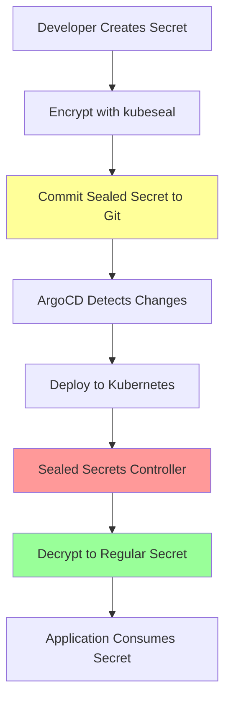

# DevSecOps CI/CD Pipeline

Complete CI/CD pipeline with integrated security scanning, automated testing, and multi-environment deployment using Jenkins, ArgoCD, and AWS services.

## Pipeline Features

- Security scanning at every stage (SAST, DAST, dependency checks, container scanning)
- Multi-environment deployment: Dev (EC2), Staging (Kubernetes), Production (Lambda)
- GitOps workflow with ArgoCD and Bitnami Sealed Secrets
- Automated quality gates and comprehensive reporting

## Infrastructure

### Components
- Jenkins Server (AWS EC2 t2.medium) - CI/CD orchestration
- Gitea Server (same EC2) - Git repository with webhooks
- MicroK8s Cluster (AWS EC2 t2.medium) - Kubernetes staging environment
- SonarQube - SAST and code quality analysis
- ArgoCD - GitOps deployment controller
- AWS Lambda - Production environment
- S3 - Artifact storage

### Deployment Environments

**Development** (`feature/*` branches)
- Target: AWS EC2 direct deployment
- Validation: Integration testing

**Staging** (`PR*` branches)  
- Target: Kubernetes via GitOps
- Validation: OWASP ZAP DAST scanning

**Production** (`main` branch)
- Target: AWS Lambda
- Validation: Function health checks
- Requires manual approval

## Prerequisites

### Infrastructure
- Jenkins Server (EC2 t2.medium)
- MicroK8s cluster with ArgoCD and Sealed Secrets controller
- AWS account with IAM roles
- DockerHub registry access

### Jenkins Plugins
- NodeJS Plugin (v24.6.0)
- SonarQube Scanner (v7.2.0) 
- OWASP Dependency Check (v12.1.2)
- AWS Pipeline Steps
- Docker Pipeline
- Slack Notification Plugin

### Security Tools
- SonarQube with quality gates
- Trivy container scanner
- OWASP ZAP for DAST
- OWASP Dependency Check

## Pipeline Stages

### Stage 1: Dependency Security Analysis (Parallel)

```groovy
// NPM Audit - Critical vulnerability detection
npm audit --audit-level=critical

// OWASP Dependency Check - Comprehensive analysis
dependencyCheck additionalArguments: '--scan ./ --format "ALL"'
```

- NPM Audit: Critical vulnerability scanning
- OWASP Dependency Check: CVE database analysis
- Failure threshold: 4 critical vulnerabilities
- Output: HTML and XML reports

### Stage 2: Code Quality & Testing

```groovy
// Unit Testing with retry logic
retry(2) {
    sh 'npm run test'
}

// Code Coverage Analysis
catchError(buildResult: 'SUCCESS', stageResult: 'UNSTABLE') {
    sh 'npm run coverage'
}
```

- Unit testing: Mocha with 2-retry logic
- Coverage threshold: 90% line coverage
- Quality gate: Tests must pass
- Reporting: JUnit XML and LCOV reports

### Stage 3: Static Application Security Testing (SAST)

```groovy
withSonarQubeEnv('sonarqube') {
    sh '$SONAR_SCANNER_HOME/bin/sonar-scanner'
}
waitForQualityGate abortPipeline: true
```

- SonarQube analysis: Code quality and security detection
- Quality gate: Pipeline aborts on failure
- Timeout: 60 seconds
- Integration: LCOV coverage data

### Stage 4: Container Security & Build

```groovy
// Docker Build
docker build -t $DOCKERHUB_USR/solar-system:$GIT_COMMIT

// Trivy Security Scanning
trivy image --severity CRITICAL --exit-code 1
trivy image --severity LOW,MEDIUM,HIGH --exit-code 0
```

- Image tagging: Git commit SHA
- Critical vulnerabilities: Pipeline fails on CRITICAL findings
- Reporting: HTML, JSON, and JUnit XML formats
- Registry push: Automated DockerHub push

### Stage 5: Environment-Specific Deployment

#### Development Deployment (`feature/*` branches)

```groovy
sshagent(['aws-ssh-ec2']) {
    // Container deployment to EC2
    // Integration testing execution
}
```

- Target: AWS EC2 direct deployment
- Strategy: Blue-green deployment
- Validation: Automated API integration testing
- Rollback: Manual intervention

#### Staging Deployment (`PR*` branches)

```groovy
// GitOps Repository Update
git clone solar-system-gitops-argocd
sed -i "s#image:.*#image:$DOCKERHUB_USR/solar-system:$GIT_COMMIT#g"

// Automated PR Creation
curl -X POST gitea-api/pulls
```

- GitOps flow: Automated manifest updates
- ArgoCD integration: Automatic sync on PR merge
- Manual gate: Human approval for ArgoCD sync
- DAST testing: OWASP ZAP security scanning

#### Production Deployment (`main` branch)

```groovy
// Manual Approval Gate
input message: 'Deploy to Production?'

// Lambda Deployment
aws lambda update-function-code --s3-bucket solar-system-lambda-bucket
```

- Approval gate: Manual production deployment approval
- Serverless strategy: AWS Lambda deployment
- Validation: Automated function URL testing
- Rollback: AWS Lambda versioning

### Stage 6: Dynamic Application Security Testing (DAST)

```groovy
// OWASP ZAP Security Scanning (PR branches only)
docker run zaproxy/zap-stable zap.sh \
  -t http://kubernetes-cluster:30000/api-docs/ \
  -f openapi -r zap_report.html
```

- Trigger: PR branches only (staging environment)
- Target: Live application endpoints via OpenAPI
- Output: HTML, Markdown, JSON, and XML reports
- Integration: JUnit XML for Jenkins

### Stage 7: Artifact Management & Reporting

```groovy
// S3 Report Upload
s3Upload(file: "reports-$BUILD_ID", bucket: 'solar-system-jenkins-reports-bucket')

// Slack Notifications
slackSend(color: color, message: buildStatus)
```

- Centralized storage: All reports uploaded to S3 with build ID
- Report types: Coverage, security scans, test results
- Notifications: Slack integration for build status
- Retention: Build artifacts for audit purposes

### Security Scanning Matrix

| Tool | Scan Type | Stage | Failure Action | Report Format |
|------|-----------|-------|----------------|---------------|
| NPM Audit | Dependency Vulnerabilities | Pre-build | Continue with warning | Console |
| OWASP Dependency Check | CVE Database Analysis | Pre-build | Fail on 4+ critical | HTML, XML, JSON |
| SonarQube | SAST | Post-test | Fail on quality gate | Web dashboard |
| Trivy | Container Scanning | Post-build | Fail on critical CVEs | HTML, JSON, XML |
| OWASP ZAP | DAST | Post-deploy | Continue (informational) | HTML, JSON, XML |

## GitOps with Sealed Secrets

### GitOps Repository Structure

```
solar-system-gitops-argocd/
├── kubernetes/
│   ├── deployment.yml       # Application deployment manifest
│   ├── service.yml          # Service configuration
│   ├── sealed-secret.yml    # 🔒 Bitnami Sealed Secret (encrypted)
│   └── secret.yml           # Secret template (for reference)
├── sealed-secrets/
│   ├── controller.yml       # Sealed Secrets controller deployment
│   └── public-key.pem       # Public key for encryption
└── argocd/
    └── application.yml      # ArgoCD application definition
```

### Sealed Secrets Implementation

Bitnami Sealed Secrets allows storing encrypted secrets in Git repositories:
- Secrets encrypted with cluster-specific keys
- Complete audit trail in Git
- Seamless ArgoCD integration

### Sealed Secrets Workflow

#### Secret Encryption Process

```bash
# Install kubeseal CLI tool
wget https://github.com/bitnami-labs/sealed-secrets/releases/download/v0.24.0/kubeseal-linux-amd64
chmod +x kubeseal-linux-amd64 && sudo mv kubeseal-linux-amd64 /usr/local/bin/kubeseal

# Create regular Kubernetes secret (locally only)
kubectl create secret generic mongo-db-creds \
  --from-literal=MONGO_USERNAME=your-username \
  --from-literal=MONGO_PASSWORD=your-password \
  --from-literal=MONGO_URI=mongodb+srv://cluster.mongodb.net/planets \
  --dry-run=client -o yaml > secret.yml

# Encrypt secret using cluster's public key
kubeseal --format=yaml --cert=public-key.pem < secret.yml > sealed-secret.yml

# Safely commit encrypted secret to Git
git add sealed-secret.yml
git commit -m "Add encrypted MongoDB credentials"
```

#### Sealed Secret Manifest Example

```yaml
apiVersion: bitnami.com/v1alpha1
kind: SealedSecret
metadata:
  name: mongo-db-creds
  namespace: solar-system
spec:
  encryptedData:
    MONGO_USERNAME: AgBy3i4OJSWK+PiTySYZZA9rO43cGDEQAx...
    MONGO_PASSWORD: AgBy3i4OJSWK+PiTySYZZA9rO43cGDEQAx...
    MONGO_URI: AgBy3i4OJSWK+PiTySYZZA9rO43cGDEQAx...
  template:
    metadata:
      name: mongo-db-creds
      namespace: solar-system
    type: Opaque
```

#### GitOps Flow with Sealed Secrets

```groovy
// Clone GitOps repository
git clone -b main http://gitea-server/solar-system-gitops-argocd

// Update image tag in deployment manifest
sed -i "s#image:.*#image:$DOCKERHUB_USR/solar-system:$GIT_COMMIT#g" deployment.yml

// Sealed secrets remain unchanged (encrypted and secure)
// No need to update secrets during image deployments

// Create feature branch and push changes
git checkout -b feature-$BUILD_ID
git commit -am "Updated docker image to $GIT_COMMIT"
git push -u origin feature-$BUILD_ID
```

#### Automated Pull Request Creation

```groovy
// Gitea API integration for PR creation
curl -X 'POST' 'http://gitea-server/api/v1/repos/mortal22soul/solar-system-gitops-argocd/pulls' \
  -H 'Authorization: token $GITEA_TOKEN' \
  -d '{
    "base": "main",
    "head": "feature-$BUILD_ID",
    "title": "Updated Docker Image",
    "body": "Automated image update to commit $GIT_COMMIT"
  }'
```

#### ArgoCD Sync with Sealed Secrets

```yaml
# ArgoCD automatically handles sealed secret decryption
apiVersion: argoproj.io/v1alpha1
kind: Application
metadata:
  name: solar-system
spec:
  source:
    repoURL: http://gitea-server/solar-system-gitops-argocd
    path: kubernetes
    targetRevision: main
  destination:
    server: https://kubernetes.default.svc
    namespace: solar-system
  syncPolicy:
    automated:
      prune: true
      selfHeal: true
    syncOptions:
      - CreateNamespace=true
```

Sync Process:
1. Pipeline waits for PR merge confirmation
2. ArgoCD monitors GitOps repository for changes
3. Controller automatically decrypts sealed secrets
4. Deploys updated manifests to Kubernetes cluster
5. Validates deployment via readiness probes

Security Benefits:
- Secrets encrypted in Git repository
- Cluster-specific encryption keys
- No plaintext secrets in Git history
- Complete audit trail including encrypted secrets
- Easy rollback via Git revert

### Sealed Secrets Controller Setup

#### Controller Installation

```bash
# Install Sealed Secrets controller in kube-system namespace
kubectl apply -f https://github.com/bitnami-labs/sealed-secrets/releases/download/v0.24.0/controller.yaml

# Verify controller is running
kubectl get pods -n kube-system | grep sealed-secrets

# Extract public key for encryption
kubeseal --fetch-cert --controller-name=sealed-secrets-controller \
  --controller-namespace=kube-system > public-key.pem
```

#### Security Features
- RSA-4096 encryption with cluster-specific keys
- Namespace scoping: Secrets only decrypt in target namespace
- Automatic key rotation
- Immutable sealed secrets

#### CI/CD Pipeline Integration

````groovy
// Pipeline stage for secret management (if needed)
stage('Update Sealed Secrets') {
    when {
        // Only when secrets need updating
        changeset "sealed-secrets/**"
    }
    steps {
        script {
            // Validate sealed secret format
            sh 'kubeseal --validate --cert=public-key.pem < sealed-secret.yml'

            // Commit updated sealed secrets
            sh '''
                git add sealed-secrets/
                git commit -m "Updated sealed secrets"
                git push origin feature-$BUILD_ID
            '''
        }
    }
}

## Container Security

### Multi-Stage Docker Build
```dockerfile
# Build stage optimization
FROM node:24.6.0-alpine AS builder
WORKDIR /app
COPY package*.json ./
RUN npm ci --only=production

# Production stage
FROM node:24.6.0-alpine
WORKDIR /app
COPY --from=builder /app/node_modules ./node_modules
COPY . .
EXPOSE 8000
CMD ["npm", "start"]
````

### Container Security Scanning

```groovy
// Trivy vulnerability assessment
trivy image $DOCKERHUB_USR/solar-system:$GIT_COMMIT \
  --severity CRITICAL --exit-code 1    # Fail pipeline on critical
  --severity HIGH,MEDIUM --exit-code 0 # Report but continue
```

### Image Management
- Tagging: Git commit SHA for immutable deployments
- Registry: DockerHub with automated push
- Retention: Images tagged with build metadata
- Security: Regular base image updates and vulnerability patching

## Kubernetes Deployment

### Cluster Configuration with Sealed Secrets

```yaml
# MicroK8s cluster on AWS EC2 t2.medium
apiVersion: apps/v1
kind: Deployment
metadata:
  name: solar-system
  namespace: solar-system
spec:
  replicas: 2
  selector:
    matchLabels:
      app: solar-system
  template:
    spec:
      containers:
        - name: solar-system
          image: aryanmehesare/solar-system:${GIT_COMMIT}
          ports:
            - containerPort: 8000
          envFrom:
            - secretRef:
                name: mongo-db-creds # Automatically decrypted by sealed-secrets controller
          env:
            - name: NODE_ENV
              value: "production"
          livenessProbe:
            httpGet:
              path: /live
              port: 8000
            initialDelaySeconds: 30
          readinessProbe:
            httpGet:
              path: /ready
              port: 8000
            initialDelaySeconds: 5
```

### Secret Management Workflow



### Service Configuration

```yaml
apiVersion: v1
kind: Service
metadata:
  name: solar-system
spec:
  type: NodePort
  ports:
    - port: 8000
      targetPort: 8000
      nodePort: 30000
  selector:
    app: solar-system
```

### ArgoCD Application Definition

```yaml
apiVersion: argoproj.io/v1alpha1
kind: Application
metadata:
  name: solar-system
spec:
  source:
    repoURL: http://gitea-server/solar-system-gitops-argocd
    path: kubernetes
    targetRevision: main
  destination:
    server: https://kubernetes.default.svc
    namespace: solar-system
  syncPolicy:
    automated:
      prune: true
      selfHeal: true
```

## Configuration

### Jenkins Master Configuration

#### Required Tools Installation

```groovy
tools {
    nodejs 'node-24-6-0'                    // NodeJS Plugin
}

environment {
    SONAR_SCANNER_HOME = tool name: 'sonar-7-2-0'
    DOCKERHUB = credentials('dockerhub-creds')
    GITEA_TOKEN = credentials('gitea-api-token')
}
```

#### Essential Jenkins Plugins

| Plugin                 | Version | Purpose                          |
| ---------------------- | ------- | -------------------------------- |
| NodeJS Plugin          | Latest  | Node.js runtime management       |
| SonarQube Scanner      | 7.2.0   | Static code analysis integration |
| OWASP Dependency Check | 12.1.2  | Vulnerability scanning           |
| AWS Pipeline Steps     | Latest  | AWS service integration          |
| Docker Pipeline        | Latest  | Container build and push         |
| Slack Notification     | Latest  | Build status notifications       |

### Credential Management Strategy

#### Jenkins Credentials Store

```groovy
// Database credentials (separate for security)
MONGO_USERNAME = credentials('mongo-user')
MONGO_PASSWORD = credentials('mongo-pass')

// Container registry access
DOCKERHUB = credentials('dockerhub-creds')  // Returns USR and PSW

// Infrastructure access
sshagent(['aws-ssh-ec2'])                   // SSH key for EC2
withAWS(credentials: 'aws-cli-creds')       // AWS CLI access
```

#### Security Best Practices
- Separation of concerns: Database, registry, and infrastructure credentials isolated
- Least privilege: Each credential has minimal required permissions
- Regular credential rotation via Jenkins
- All credential usage logged in Jenkins build logs

### Pipeline Options & Optimization

```groovy
options {
    timeout(time: 1, unit: 'HOURS')           // Prevent hanging builds
    disableConcurrentBuilds abortPrevious: true  // Resource optimization
    disableResume()                           // Clean state management
}
```

### Environment-Specific Configuration

#### Environment Configuration

**Development**
- Target: AWS EC2 (65.0.87.74)
- Deployment: Direct Docker container
- Testing: Integration testing via bash script
- Rollback: Manual container restart

**Staging**
- Target: MicroK8s cluster (43.205.242.235:30000)
- Deployment: GitOps via ArgoCD
- Testing: OWASP ZAP DAST scanning
- Rollback: ArgoCD UI or kubectl rollback

**Production**
- Target: AWS Lambda (solar-system-function)
- Deployment: S3 upload + Lambda function update
- Testing: Function URL health check
- Rollback: Lambda version management

## Project Structure

```
├── Jenkinsfile                     # CI/CD Pipeline Definition
├── kubernetes/                     # Kubernetes Manifests
│   ├── deployment.yml             # Application deployment config
│   ├── service.yml                # Service and networking config
│   └── secret.yml                 # Secret template for credentials
├── integration-testing-ec2.sh     # Integration test automation
├── Dockerfile                     # Container build definition
├── oas.json                       # OpenAPI spec for DAST testing
├── package.json                   # Dependencies and test scripts
├── app-test.js                    # Unit test suite
├── coverage/                      # Generated coverage reports
├── .env.example                   # Environment configuration template
└── [Application Files]            # Sample application code
```

### Pipeline Artifacts & Reports

```
Generated during pipeline execution:
├── dependency-check-report.xml    # OWASP dependency scan results
├── test-results.xml              # JUnit test results
├── coverage/lcov-report/         # Code coverage HTML reports
├── trivy-image-*.html            # Container vulnerability reports
├── zap_report.html               # DAST security scan results
└── reports-${BUILD_ID}/          # Consolidated reports for S3 upload
```

## Monitoring

### Build Metrics
- Pipeline success rate via Jenkins build history
- Security gate failures per tool
- Deployment frequency per environment
- Mean Time to Recovery (MTTR)
- Code coverage trends (90% threshold)

### Notification Strategy

```groovy
def slackNotificationMethod(String buildStatus) {
    def color = buildStatus == 'SUCCESS' ? '#47ec05' : '#ec2805'
    def msg = "${buildStatus}: *${env.JOB_NAME}* #${env.BUILD_NUMBER}"
    slackSend(color: color, message: msg)
}
```

### Health Check Endpoints

| Endpoint     | Purpose            | Environment           |
| ------------ | ------------------ | --------------------- |
| `/live`      | Liveness probe     | All environments      |
| `/ready`     | Readiness probe    | Kubernetes staging    |
| `/os`        | System information | Development debugging |
| Function URL | Lambda health      | Production validation |

## Branch Strategy

### Git Branching Model

```
main branch (Production)
├── feature/user-auth     → EC2 Development Deployment
├── feature/api-v2        → EC2 Development Deployment
└── PR-123-hotfix        → Kubernetes Staging Deployment
```

### Automated Deployment Triggers

#### Development Flow (`feature/*`)

```groovy
when { branch 'feature/*' }
steps {
    // 1. Deploy to EC2 development environment
    // 2. Run integration tests
    // 3. Generate development reports
}
```

#### Staging Flow (`PR*`)

```groovy
when { branch 'PR*' }
steps {
    // 1. Update GitOps repository
    // 2. Create automated PR for manifest changes
    // 3. Wait for ArgoCD sync confirmation
    // 4. Execute DAST security testing
}
```

#### Production Flow (`main`)

```groovy
when { branch 'main' }
steps {
    // 1. Manual approval gate
    // 2. Deploy to AWS Lambda
    // 3. Validate function deployment
    // 4. Execute production health checks
}
```

### Quality Gates & Requirements

#### Security Gates
- Dependency scan: < 4 critical CVEs
- Unit tests: 100% pass rate with 90% coverage
- SAST analysis: SonarQube quality gate must pass
- Container scan: No critical vulnerabilities in final image
- DAST testing: Security scan completion (informational)

#### Pipeline Failure Scenarios

```groovy
// Critical dependency vulnerabilities
dependencyCheckPublisher(failedTotalCritical: 4, stopBuild: true)

// SonarQube quality gate failure
waitForQualityGate abortPipeline: true

// Critical container vulnerabilities
trivy --severity CRITICAL --exit-code 1
```

## Getting Started

### 1. Fork and Configure Repository

```bash
git clone https://github.com/mortal22soul/e2e-cicd-pipeline
cd solar-system

# Configure your Jenkins webhook
# Update Jenkinsfile with your infrastructure details
```

### 2. Jenkins Setup Checklist

- [ ] Install required plugins (NodeJS, SonarQube, OWASP, AWS, Docker)
- [ ] Configure tool installations (Node.js 24.6.0, SonarQube Scanner 7.2.0)
- [ ] Add credentials (MongoDB, DockerHub, AWS, SSH keys)
- [ ] Set up webhook integration with your Git repository

### 3. Infrastructure Prerequisites

- [ ] AWS EC2 instances (Jenkins + Development environment)
- [ ] MicroK8s cluster with ArgoCD and Sealed Secrets controller installed
- [ ] SonarQube server configuration
- [ ] DockerHub registry access
- [ ] AWS Lambda function setup
- [ ] Bitnami Sealed Secrets controller deployed in cluster

### 4. Test Pipeline Execution

```bash
# Create feature branch to test development flow
git checkout -b feature/test-pipeline
git push origin feature/test-pipeline

# Create PR branch to test staging flow
git checkout -b PR-001-test-staging
git push origin PR-001-test-staging

# Merge to main to test production flow
git checkout main
git merge feature/test-pipeline
git push origin main
```

## Security Implementation

### Security Measures
- Dependency scanning: Automated vulnerability detection
- Static analysis: Code quality and security issues
- Container scanning: Image vulnerability assessment
- Dynamic testing: Runtime security testing
- Secret management: Bitnami Sealed Secrets for encrypted storage
- Access control: Least privilege with RBAC
- Zero trust: No plaintext secrets in repositories

### Reports
- Dependency Check: HTML vulnerability report
- Code Coverage: LCOV HTML report
- Trivy Security: Container vulnerability report
- OWASP ZAP: Dynamic security testing report
- SonarQube: Code quality dashboard

Report storage: Local workspace, S3 centralized storage, Jenkins integration

## Future Enhancements
- Prometheus + Grafana monitoring
- ELK stack logging
- Istio service mesh
- Policy as Code with OPA
- Performance testing integration
